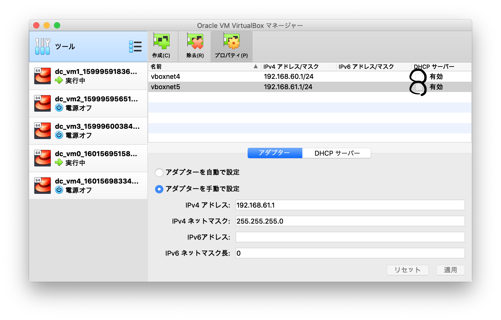

## 今日から俺は...

毎日ブログ書きます。  
学校のことも忙しいけど、毎日少しでもインプットしてアウトプットする。


## 今日の目標 !

・DHCPを使って、動的にIPアドレスを割り当てる。  
・学校の勉強  

## 今日の進捗

#### DHCPを使って、動的にIPアドレスを割り当てる
サーバー側( 192.168.60.1 )で  
```bash
$ yum install -y dhcp  
$ vi /etc/dhcp/dhcpd.conf  
ddns-update-style  none;  
default-lease-time 28800;  
max-lease-time     86400;  

subnet 192.168.60.0 netmask 255.255.255.0 {  
    authoritative;  
    range 192.168.60.101 192.168.60.199;  
    option subnet-mask    255.255.255.0;  
    option routers        192.168.60.254;  
}  
$ systemctl start dhcpd  
```

クライアント側( 192.168.60.3 )で  
```bash
$ sudo -E su
$ vi /etc/sysconfig/network-scripts/ifcfg-eth1  
..
BOOTPROTO=dhcp
..
..

$ ifdown eth1  
$ ifup eth1  
$ ip a  
3: eth1: <BROADCAST,MULTICAST,UP,LOWER_UP> mtu 1500 qdisc pfifo_fast state UP group default qlen 1000  
    link/ether 08:00:27:04:61:e6 brd ff:ff:ff:ff:ff:ff  
    inet 192.168.60.7/24 brd 192.168.60.255 scope global noprefixroute dynamic eth1
       valid_lft 1198sec preferred_lft 1198sec  
    inet 192.168.60.3/24 brd 192.168.60.255 scope global secondary noprefixroute eth1  
       valid_lft forever preferred_lft forever  
    inet6 fe80::a00:27ff:fe04:61e6/64 scope link  
       valid_lft forever preferred_lft forever  
```


あれ...サーバー側で  
`range 192.168.60.101 192.168.60.199;`  
としたので、192.168.60.101がついていて欲しいのに、192.168.60.7がついてる...  

サーバー側で   
```bash
$ cat /var/log/messages
...
Oct  3 15:58:34 localhost dhcpd: DHCPDISCOVER from 08:00:27:04:61:e6 via eth1
Oct  3 15:58:35 localhost dhcpd: DHCPOFFER on 192.168.60.101 to 08:00:27:04:61:e6 via eth1
Oct  3 15:58:34 localhost dhcpd: DHCPREQUEST for 192.168.60.7 (192.168.60.2) from 08:00:27:04:61:e6 via eth1: unknown lease 192.168.60.7.
Oct  3 16:01:01 localhost systemd: Created slice User Slice of root.
Oct  3 16:01:01 localhost systemd: Started Session 33 of user root.
Oct  3 16:01:01 localhost systemd: Removed slice User Slice of root.
Oct  3 16:02:16 localhost dhcpd: DHCPREQUEST for 192.168.60.7 from 08:00:27:04:61:e6 via eth1: unknown lease 192.168.60.7.

```

**「クライアントが DHCP 情報を要求する : DHCPDISCOVER」**  
`DHCPDISCOVER from 08:00:27:04:61:e6 via eth1`  
クライアント側のインターフェース eth1 からちゃんとDHCP情報を要求している。  

**「DHCP サーバーが、クライアントに対して情報を提供する : DHCPOFFER」**  
`DHCPOFFER on 192.168.60.101 to 08:00:27:04:61:e6 via eth1`  
192.168.60.101をちゃんと提供しようとしている  

**「クライアントが DHCP サーバーのオファーを受け入れる : DHCPREQUEST」**  
`DHCPREQUEST for 192.168.60.7 (192.168.60.2) from 08:00:27:04:61:e6 via eth1:  unknown lease 192.168.60.7.`  
問題はここ。  
・192.168.60.2ってどこから出てきた？  
--> Virtualboxの設定で勝手にDHCPサーバーが立ち上がってて、それが192.168.60.2だった。


